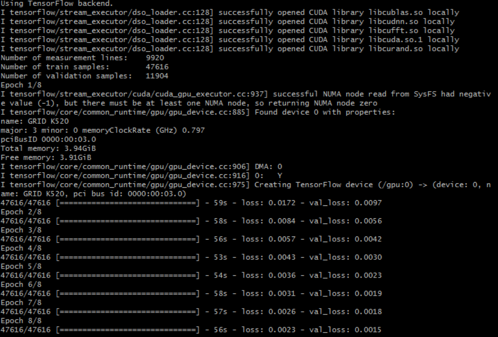
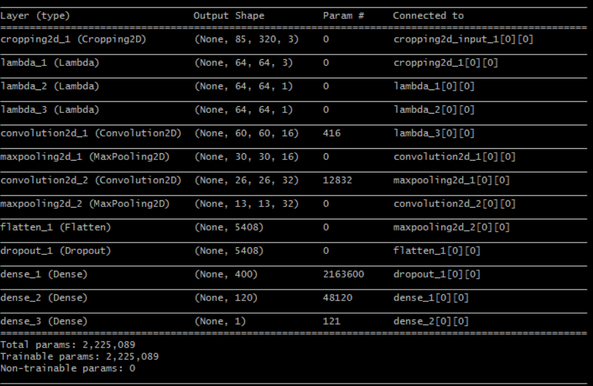
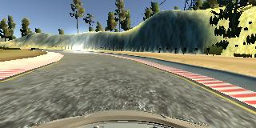
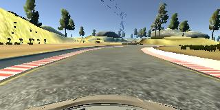
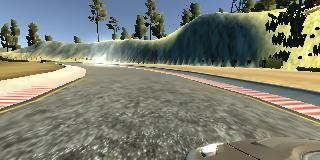
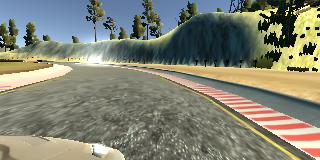

# **Behavioral Cloning**

## Project Writeup

---

**Behavioral Cloning Project**

The goals / steps of this project are the following:
* Use the simulator to collect data of good driving behavior
* Build, a convolution neural network in Keras that predicts steering angles from images
* Train and validate the model with a training and validation set
* Test that the model successfully drives around track one without leaving the road
* Summarize the results with a written report

---

## Rubric Points
### Here I will consider the [rubric points](https://review.udacity.com/#!/rubrics/432/view) individually and describe how I addressed each point in my implementation.  

---

### Files Submitted & Code Quality

#### 1. Submission includes all required files and can be used to run the simulator in autonomous mode

My project includes the following files:
* [model.py](model.py) containing the script to create and train the model
* [drive.py](drive.py) for driving the car in autonomous mode
* [model.h5](model.h5) containing a trained convolution neural network 
* [writeup_report.md](writeup_report.md) summarizing the results


#### 2. Submission includes functional code
Using the Udacity provided simulator and the original [drive.py](drive.py) file, the car can be driven autonomously around the track by executing 
```sh
python drive.py model.h5
```
[drive.py](drive.py) required no modifications since all normalization of the trainig images are made inside of the model. 

#### 3. Submission code is usable and readable

The [model.py](model.py) file contains the code for training and saving the convolution neural network. The file shows the pipeline I used for training and validating the model, and it contains comments to explain how the code works.


### Model Architecture and Training Strategy

#### 1. An appropriate model architecture has been employed

I started with simple Lenet model without any changes just to test the code and the collected driving data. I did not use the data batch generator at that point since the dataset was not originaly too big. That did not give me good results and I implemented nVidia model which I could train also without a generator and even to drive one lap. Then I tried to improve the model by collecting more data and adding more augmented images. Finaly I ran out of memory that forced me to implement a data generator. In my code I am using a *use_generator* flag to train the model with generator.

Later I decided to try using my Lenet model from the Traffic Sign Classifier project and found it was performing very well. I decided to stick with Lenet architecture because because the model was lighter, trained faster and required less memory resources than nVidia. In my code both models are presented but I choose Lenet model for final submission.  


My model consists of a convolution neural network with 5x5 filter sizes and depths between 16 and 32 ([model.py](model.py) lines 202-209) 

The model includes RELU layers to introduce nonlinearity, and the data is normalized in the model using 3 Keras lambda layers (code lines 185-192). 


#### 2. Attempts to reduce overfitting in the model

The model contains a dropout layer in order to reduce overfitting ([model.py](model.py) lines 212). 


#### 3. Model parameter tuning

The model used an adam optimizer, so the learning rate was not tuned manually ([model.py](model.py) line 249). The major tuning was in finding a good keep probability value of the dropout value for regularization of the model. 


#### 4. Appropriate training data

Training data was chosen to keep the vehicle driving on the road. I used a combination of center lane driving and recovering from the left sides of the road. Adding data of the recovery from the right side did not give much improvement but increased the training time so I decided not to add it to the final dataset.

For details about how I created the training data, see the next section. 


### Model Architecture and Training Strategy

#### 1. Solution Design Approach

The overall strategy for deriving a model architecture was to get a minimal training and validation loss.

My first step was to use a convolution neural network model similar to the what I had design in the Traffic Sign Classifier project. I thought this model might be appropriate because it has already demonstrated good behavior in the previous project. Beside I was curious if I can use it for different tasks like the behavioral cloning with different image size. 

In order to gauge how well the model was working, I split my image and steering angle data into a training and validation set. To combat the overfitting, I reduced the keep probability of the dropout layer. That was the only modification to get good training and validation results as depicted in the below snapshot:



At the end of the process, the vehicle is able to drive autonomously around the track without leaving the road.


#### 2. Final Model Architecture

The final model architecture ([model.py](model.py) lines 195-219) consisted of a convolution neural network with the following summary of layers and layer sizes:



Here is a visualization of the architecture (note: visualizing the architecture is optional according to the project rubric)

![alt text][image1]

#### 3. Creation of the Training Set & Training Process

To capture good driving behavior, I first recorded two laps on track one using center lane driving. Here is an example image of center lane driving:


Then I drove one lap in opposit direction in oder to collect more data:


I then recorded the vehicle recovering from the left side of the road back to center so that the vehicle would learn to get to the center line. I did not take the recovery from the right side that can be simulated by flipping left side recovery images. 

To augment the dataset, I also flipped images and angles thinking that this would give a good example of recovering data for driving around the turns.

I also added left and right camera images to the dataset using it as an augmented data.

Left camera:

Right camera:


After the collection process, I had 9920 number of data points. I then preprocessed this data by:
* Cropping the original images 50 pixels from top to exclude the background view and 25 pixels from bottom to exclude the hood
* Resizing the images to 64x64
* Grayscaling the images for easy processing
* Normalizing and mean centering pixels of the images around zero point
All preprocessing is performed inside of the model using Lambda layer and Keras backend low level library.

I finally randomly shuffled the data set and put 20% of the data into a validation set. The final train dataset contained 47616 images and measurements (steering angles). The validation set - 11904 points. 

I used this training data for training the model. The validation set helped determine if the model was over or under fitting. The ideal number of epochs was 8. I used an adam optimizer so that manually training the learning rate wasn't necessary. Also I implemented a generator to get the training data using a batch size of 32.

I tested the trained model on the first track only - it was too tricky to drive the second track for data collection.
